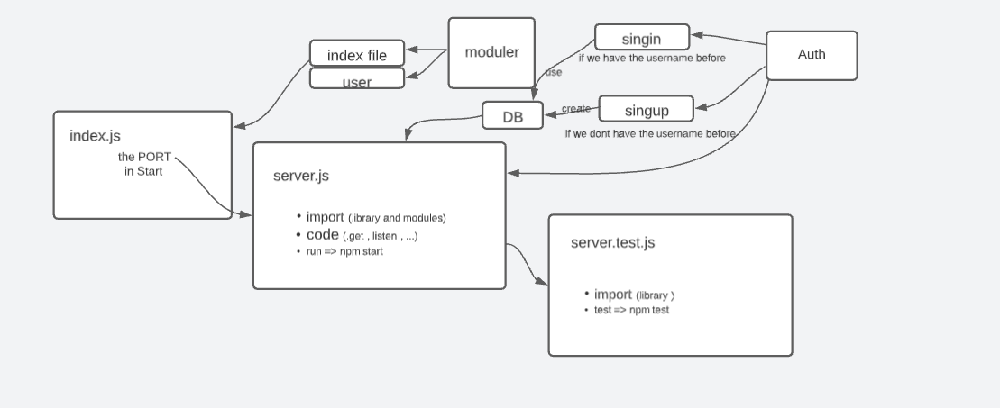

# basic-auth (lab06)

[github-lab06](https://github.com/mr-atta/basic-auth)

- run the code by using npm start || nodemon
- test the code by using npm test || on the github

> finish time : 6:00 pm

